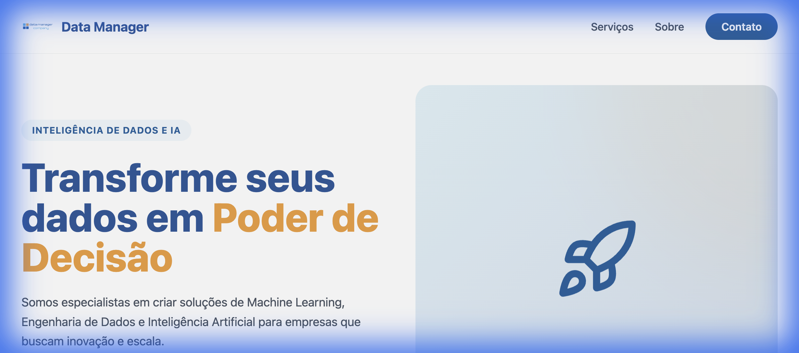
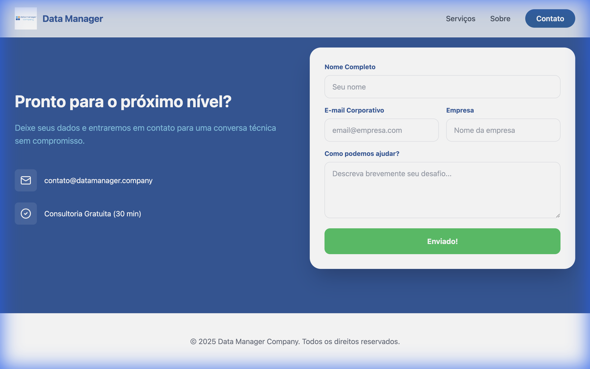

# Data Manager Company - Landing Page

Esta é a Landing Page oficial da **Data Manager Company**, uma empresa especializada em Consultoria de Dados, Inteligência Artificial e Engenharia de Dados.

O projeto foi desenvolvido com uma arquitetura moderna, utilizando **ReactJS** no Frontend e **Python (FastAPI)** no Backend.

## 🚀 Tecnologias

### Frontend
- **ReactJS** (Vite)
- **TailwindCSS** (Estilização Premium)
- **Framer Motion** (Animações)
- **Lucide React** (Ícones)

### Backend
- **Python 3.11+**
- **FastAPI** (API de alta performance)
- **Uvicorn** (Servidor ASGI)
- **Pydantic** (Validação de dados)

## 📸 Screenshots

### Seção Hero


### Formulário de Contato (Sucesso)


## 🛠️ Como Executar

### Pré-requisitos
- Node.js (v18+)
- Python (v3.11+)

### 1. Backend (Python)
```bash
cd backend
python3 -m venv venv
source venv/bin/activate  # macOS/Linux
pip install -r requirements.txt
python3 main.py
```
O servidor estará rodando em: `http://localhost:8000`

### 2. Frontend (React)
```bash
cd frontend
npm install
npm run dev
```
O site estará disponível em: `http://localhost:5173`

## 📧 Contato
Empresa voltada para:
- Consultoria Estratégica
- Criação de produtos com IA
- Engenharia de Dados
- Machine Learning
- Deep Learning
- Data Science

---
© 2025 Data Manager Company. Todos os direitos reservados.
